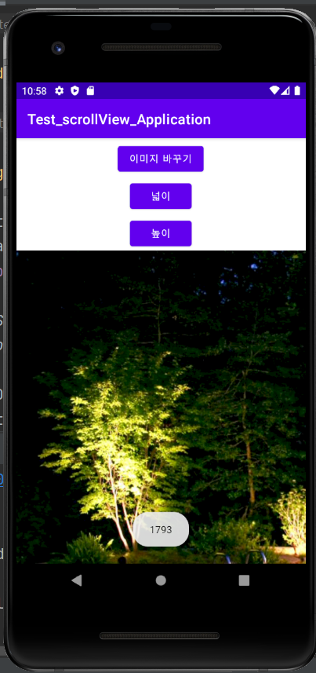

# 20173026 강재영

## 1주차 과제

## 2주차 과제
  </img>
  
  
## 3주차 과제
  </img>
  </img>

## 4주차 과제
   -아이디어 명:< 차박하기 좋은 장소들을 추천하고 예약하는 앱>
   
   차박이 유행하는 요즘 처음하는 사람들은 차박을 하기 위해 어디를 가야할지, 뭘 챙겨가야 하는지 잘 모를 겁니다. 
   지도를 통해서 사람들이 많이 가는 장소를 추천하고 예약할 수 있다면, 차박을 처음 해보는 사람도 위험하지 않은 곳에서 휴식을 취할 수 있을 것입니다.
   또한 차박 유경험자들이 팁들을 공유해 즐거운 차박을 즐길 수 있을 것입니다!

## 5주차 과제
  </img>
  </img>

## 6주차 과제
 </img>
 </img>
 </img>

## 7주차 과제
 </img>
 </img>
 
 ## 9주차 과제
 </img>

